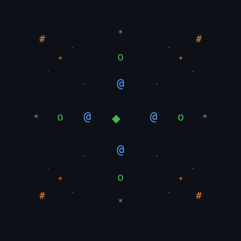

<p align="center">
  
</p>

<p align="center">
  
</p>

<p align="center">
  <i>"Curiosity first. Expertise follows."</i>
</p>

---

**📍 Hyderabad, India** • **🎓 B.Tech Electrical Engineering**

I'm a fourth-year Electrical Engineering student who loves understanding how things work below the surface — Android internals, Linux systems, firmware, networking, and computer architecture. I learn by breaking things, fixing them, and writing about what I discover.

---

## 🛠️ Tech Arsenal

### What I Work With

```
Web Basics          ████████░░  HTML & CSS
Git                 ██████░░░░  Version Control
GitHub              ███████░░░  Collaboration
Linux               ██████░░░░  Daily Driver
Android             █████████░  Custom ROMs & Rooting
```

### ⚡ System-Level Expertise


`Android Rooting` `Custom ROMs` `KernelSU` `Bootloader` `Recovery` `Device Troubleshooting` `Networking` `System Administration`

### 🧠 Currently Leveling Up

```
🌐 Web Development     ████░░░░░░  Building my portfolio
🐧 Linux Deep Dive     ██████░░░░  Understanding the kernel
🔒 Cybersecurity       ████░░░░░░  Fundamentals & concepts
⚙️ Computer Arch       ██████░░░░  Low-level computing
```

---

## 🎯 What Drives Me

| Area | What I Explore |
|------|---------------|
| 📱 **Android & Mobile** | Custom ROMs, rooting, internals, mobile security |
| 🔓 **Open Source & Privacy** | FOSS, self-hosting, privacy-first alternatives |
| ⚡ **Engineering** | Embedded systems, IoT, smart grids, computer architecture |
| 🔬 **Emerging Tech** | Quantum computing, AI, edge computing |

---

## 🏆 Certifications

| Certification | Platform |
|:---|---:|
| Cloud Computing | NPTEL |
| AI Concepts & Techniques | NPTEL |
| Smart Grid Technologies | NPTEL |

---

## 📊 GitHub Pulse

<p align="center">
  
</p>

<p align="center">
  
  
</p>

---

## 📬 Let's Connect

<p align="center">
  <a href="https://Sampath2417k.is-a.dev"></a>
  <a href="https://github.com/Sampath2417k"></a>
</p>

---

<p align="center">
  
</p>

> 💡 Fun fact: I've flashed more custom ROMs than I've built web projects. I fix software problems just to understand *why* they happened.
